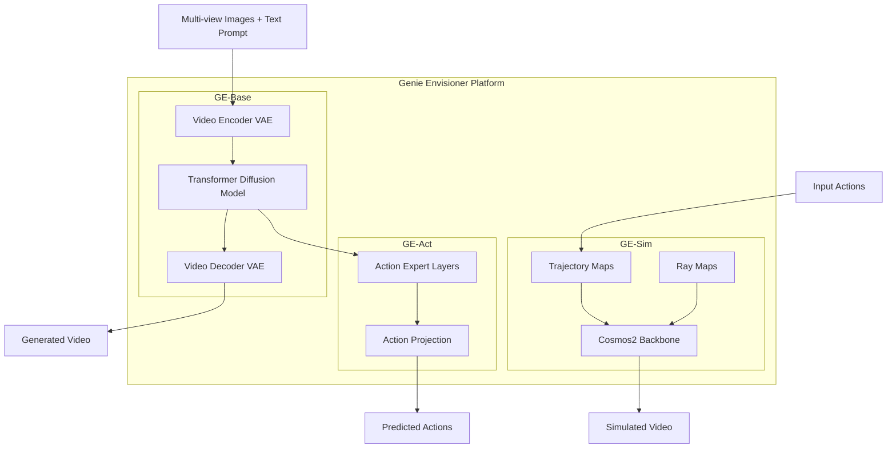
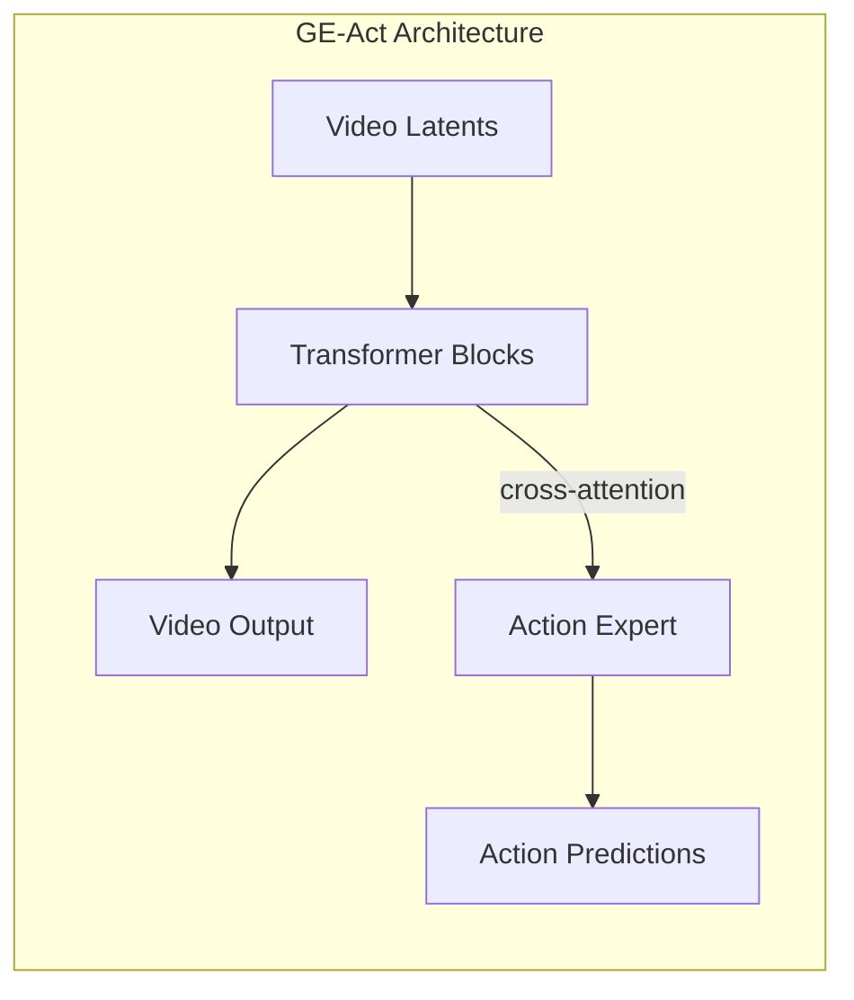
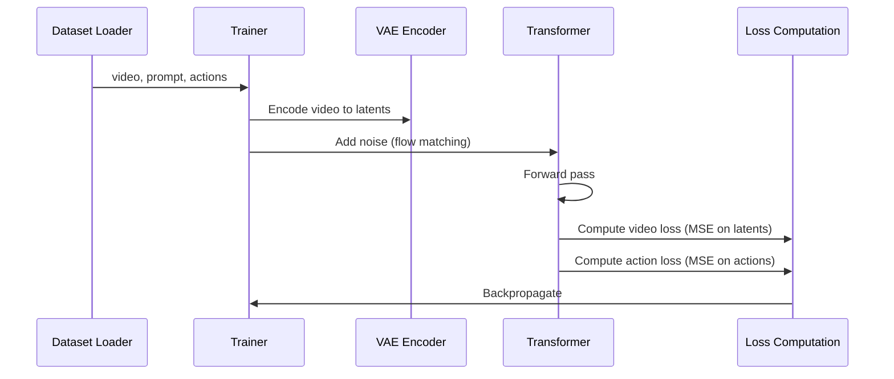
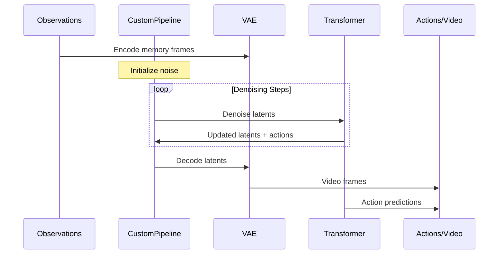

# Genie-Envisioner Knowledge Base

> A Unified World Foundation Platform for Robotic Manipulation

This knowledge base provides comprehensive documentation of the Genie-Envisioner codebase. Click on sections to expand them.

**Core Components:**
- **GE-Base** - Foundation video prediction model
- **GE-Act** - Action prediction policy model  
- **GE-Sim** - Action-conditioned world model for simulation

---

## Project Overview

Genie-Envisioner is a unified world foundation platform for robotic manipulation that combines:

- **Video prediction** (world modeling)
- **Action prediction** (policy learning)
- **Simulation** (action-conditioned generation)

The platform is built on top of diffusion-based video generation models (LTX-Video and Cosmos) and extends them with action prediction capabilities for robotics applications.

### Key Publications
- [Genie Envisioner Paper](https://arxiv.org/abs/2508.05635)
- Previous work: [EnerVerse](https://arxiv.org/abs/2501.01895)
- Previous work: [EnerVerse-AC](https://arxiv.org/abs/2505.09723)

### Related Resources
- [AgiBotWorld Dataset](https://huggingface.co/datasets/agibot-world/AgiBotWorld-Beta)
- [Embodied World Model Benchmark (EWMB)](https://github.com/AgibotTech/EWMBench)

---

## Architecture Overview



### Core Design Principles

1. **Multi-view Support**: All models support multiple camera views (head, hand_left, hand_right)
2. **Memory-based Conditioning**: Uses sparse memory frames for temporal context
3. **Flow Matching**: Uses flow matching for diffusion training and inference
4. **Unified Architecture**: Shared transformer backbone with task-specific experts

---

## GE-Base: Foundation Video Model

GE-Base is the foundation video prediction model that serves as the backbone for both GE-Act and GE-Sim.

### Simple Explanation

**What does GE-Base do?**

GE-Base is like a "video imagination machine" for robots. You show it:
1. **A few photos** from what the robot has seen recently (from its cameras)
2. **A text instruction** describing what the robot should do (like "pick up the cup")

And it **imagines what the video will look like** as the robot performs that task.

```
┌─────────────────┐     ┌─────────────┐     ┌─────────────────────┐
│  Past Photos    │     │             │     │  Imagined Video     │
│  (3-4 frames    │ ──► │   GE-Base   │ ──► │  (what will happen  │
│   from cameras) │     │             │     │   in the future)    │
└─────────────────┘     └─────────────┘     └─────────────────────┘
        +                      ▲
┌─────────────────┐            │
│  "pick up the   │ ───────────┘
│   red block"    │
└─────────────────┘
```

**Why is this useful?**
- It helps the robot "think ahead" about what will happen
- It serves as the foundation for GE-Act (which predicts actions) and GE-Sim (which simulates with actions)
- The robot has **3 cameras** (head camera, left hand camera, right hand camera), and GE-Base understands all 3 views together

---

### Memory Frames: What They Are and How They Work

<details>
<summary><b>📖 Simple Explanation of Memory Frames</b></summary>

**What are "Memory Frames"?**

Memory frames are like the robot's "short-term memory" - a few carefully selected images from the past that help the model understand:
- Where things are in the scene
- What has already happened
- The robot's current state

Think of it like this: if you were asked to predict what happens next in a movie, you'd want to see the last few seconds, not just a single frame. Memory frames give the model that context.

**How many memory frames?**

| Config | Memory Frames | Prediction Frames | Total Video Frames |
|--------|---------------|-------------------|-------------------|
| GE-Base-slow | **4** | 57 (video) | 57 |
| GE-Base-fast | **4** | 9 (video) / 54 (action) | 9 |

**The key insight:** Memory frames are separate from prediction frames. The model sees 4 past images as context, then generates new future frames.

</details>

<details>
<summary><b>🔧 Technical Details: How Memory Works</b></summary>

**1. Memory Frame Selection (During Training)**

Memory frames are selected from the video history using the `get_frame_indexes()` function:

```python
def get_frame_indexes(self, total_frames):
    """
    1. Randomly select end frame
    2. Take frames from {end-action_chunk} to {end} as prediction frames  
    3. Uniformly/randomly select n_previous memory frames from history
    """
    # Select memory frames
    if self.previous_pick_mode == 'uniform':
        # Evenly spaced across history
        mem_indexes = [mem_candidates[int(i)] 
                       for i in np.linspace(0, len(mem_candidates)-1, self.n_previous)]
    elif self.previous_pick_mode == 'random':
        # Randomly sampled (but last one is always the most recent)
        mem_indexes = sorted(random.sample(mem_candidates[:-1], self.n_previous-1)) 
                     + [mem_candidates[-1]]
```

**2. Memory Encoding (Separate from Video)**

Memory frames are encoded **separately** by the VAE, then used as conditioning:

```python
# From utils/data_utils.py - get_latents()
def get_latents(vae, mem, video, ...):
    """
    mem: (b*v, c, m, h, w) - m memory frames per view
    video: (b*v, c, f, h, w) - f prediction frames per view
    """
    # Encode video frames together
    video_latents = vae.encode(video).latent_dist.sample()
    
    # Encode memory frames SEPARATELY (each frame independently)
    mem = rearrange(mem, 'b c m h w -> (b m) c h w').unsqueeze(2)
    mem_latents = vae.encode(mem).latent_dist.sample()
```

**3. Memory Conditioning (During Denoising)**

Memory frames are inserted at the beginning of the latent sequence and kept "clean" (low noise):

```python
# From utils/data_utils.py - gen_noise_from_condition_frame_latent()
def gen_noise_from_condition_frame_latent(condition_frame_latent, latent_num_frames, ...):
    """
    Memory frames conditioning:
    - Memory frames get low/zero noise (timestep close to 0)
    - Prediction frames get full noise (timestep = t)
    """
    # Repeat first memory frame to fill prediction slots
    init_latents = condition_frame_latent[:,:,:1].repeat(1, 1, latent_num_frames, 1, 1)
    init_latents[:,:,:mem_size] = condition_frame_latent
    
    # Create conditioning mask: 1.0 for memory, 0.0 for prediction
    conditioning_mask = torch.zeros(mask_shape)
    conditioning_mask[:, :, :mem_size] = 1.0
    
    # Optional: add small noise to memory frames for robustness
    rand_noise_ff = random.random() * noise_to_condition_frames  # 0-10% noise
    
    # Final latents: memory is clean, prediction is noisy
    latents = init_latents * (1 - noise_mask) + noise * noise_mask
```

**4. Per-Token Timesteps**

The model uses **different timesteps for different tokens**:

```python
# Memory tokens: timestep ≈ 0 (already denoised)
# Prediction tokens: timestep = t (being denoised)

if pixel_wise_timestep:
    timestep = t * (1 - conditioning_mask)  # 0 for memory, t for prediction
```

This is controlled by `pixel_wise_timestep: True` in the config.

</details>

<details>
<summary><b>⚙️ Configuration Parameters</b></summary>

| Parameter | Default | Description |
|-----------|---------|-------------|
| `n_previous` | 4 | Number of memory frames |
| `previous_pick_mode` | `random` or `uniform` | How to select memory frames from history |
| `chunk` | 57 (slow) / 9 (fast) | Number of video frames to predict |
| `action_chunk` | 57 / 54 | Number of action steps to predict |
| `sample_n_frames` | 900 | Total frames to sample from (for training) |
| `noise_to_first_frame` | 0.1 | Max noise added to memory frames |

**Config example:**
```yaml
data:
  train:
    n_previous: 4              # 4 memory frames
    previous_pick_mode: random # Randomly selected (not uniform)
    chunk: 57                  # 57 prediction frames
    action_chunk: 57           # 57 action predictions
```

</details>

<details>
<summary><b>📊 Memory Frame Timeline Visualization</b></summary>

**GE-Base-slow (chunk=57):**
```
Video Timeline:
├────────────────────────────────────────────────────────────────────────┤
 ▼         ▼              ▼                    ▼     ▼▼▼▼▼▼▼▼▼▼▼▼▼▼▼▼▼▼▼▼
mem[0]   mem[1]        mem[2]              mem[3]   pred[0..56] (57 frames)
 └─────── History ──────────────────────────┘        └── Future ──────┘
                                                           
Memory: 4 frames (sparsely sampled from past)
Prediction: 57 frames (continuous chunk to predict)
```

**GE-Base-fast (chunk=9, action_chunk=54):**
```
Video Timeline:
├────────────────────────────────────────────────────────────────────────┤
 ▼        ▼             ▼                   ▼     ▼▼▼▼▼▼▼▼▼
mem[0]  mem[1]       mem[2]             mem[3]   pred[0..8] (9 video frames)
                                                  └ BUT 54 action predictions ┘

Video: Low-frequency (9 frames at lower FPS)  
Action: High-frequency (54 steps at higher FPS)
```

</details>

### Inputs and Outputs (Technical Details)

#### Inputs

| Input | Shape | Description |
|-------|-------|-------------|
| **Memory Frames** | `(B*V, 3, M, H, W)` | M sparse frames from history, RGB normalized to [-1, 1] |
| **Text Prompt** | `str` | Natural language task description (e.g., "pick up the red block") |
| **Diffusion Timestep** | `(B,)` | Current denoising timestep [0, 1] |
| **Noisy Latents** | `(B*V, C, T', H', W')` | Noisy video latents being denoised |

Where:
- `B` = batch size
- `V` = number of views (typically 3: head, hand_left, hand_right)
- `M` = number of memory frames (typically 4)
- `H, W` = image height/width (e.g., 192×256)
- `T'` = latent temporal dimension
- `H', W'` = latent spatial dimensions
- `C` = latent channels (128)

#### Outputs

| Output | Shape | Description |
|--------|-------|-------------|
| **Predicted Video** | `(B*V, 3, T, H, W)` | Generated future video frames, RGB in [-1, 1] |
| **Video Latents** | `(B*V, C, T', H', W')` | Denoised latent representation |

#### Example Usage

```python
# Inputs
memory_frames = torch.randn(3, 3, 4, 192, 256)  # 3 views, 4 memory frames
prompt = "pick up the red block and place it on the blue plate"

# Model inference
output = pipeline(
    prompt=prompt,
    media_items=memory_frames,
    height=192,
    width=256,
    num_frames=57,
    num_inference_steps=50,
)

# Output: predicted video (3 views × 57 frames × 192×256)
video = output.frames  # shape: (3, 3, 57, 192, 256)
```

### Running Custom Inference

You can create your own test sample with custom images and prompts.

<details>
<summary><b>📁 Required Folder Structure</b></summary>

```
your_sample/
├── head_color/           # Head camera images
│   ├── 0.png
│   ├── 1.png
│   ├── 2.png
│   └── 3.png
├── hand_left_color/      # Left hand camera images  
│   ├── 0.png, 1.png, 2.png, 3.png
├── hand_right_color/     # Right hand camera images
│   ├── 0.png, 1.png, 2.png, 3.png
└── prompt.txt            # Single line with your task description
```

</details>

<details>
<summary><b>▶️ Run Inference Command</b></summary>

```bash
python video_gen_examples/infer.py \
    --config_file configs/ltx_model/video_model_infer_slow.yaml \
    --image_root your_sample/ \
    --prompt "pick up the red block" \
    --output_path results/my_test
```

</details>

<details>
<summary><b>⚙️ Memory Frames Configuration</b></summary>

The number of memory frames is controlled by `n_previous` in the config:

```yaml
data:
  train:
    n_previous: 4    # Number of history frames (0.png to 3.png)
```

> [!WARNING]
> The model was **trained with 4 memory frames**. Using a different number (3 or 5) may produce poor results. If you only have 3 frames, duplicate one to get 4.

</details>

<details>
<summary><b>⚠️ Important: Why Your Custom Inference May Not Work Well</b></summary>

**1. Domain Mismatch**

GE-Base was trained on **AgiBotWorld** dataset, which features:
- Specific robot types (dual-arm manipulation robots)
- Specific environments (supermarket, kitchen, etc.)
- Specific camera setups and viewpoints

If your images are from a different robot or environment, the model may struggle.

**2. Prompt Format**

The model was trained with prompts in a specific format:

```
Task Name: Step 1 description., Step 2 description., Step 3 description.
```

**Example from training data:**
```
Pickup items in the supermarket: Retrieve cucumber from shelf., Place held cucumber into plastic bag in shopping cart., Retrieve tomato from shelf.
```

**Tips for better prompts:**
- Use the `Task: step1., step2., step3.` format
- Be specific and descriptive
- Match the style of AgiBotWorld task descriptions

**3. Caption Dropout During Training**

The model was trained with 6% caption dropout (`caption_dropout_p: 0.06`), meaning it doesn't always rely heavily on prompts. The visual context from memory frames is often more important than the text.

**4. Fine-tuning Required**

For best results on custom robots/environments, you should:
1. **Video Adaptation**: Fine-tune GE-Base on your robot's videos
2. Then run inference with the adapted model

```bash
# Fine-tune on your data first
bash scripts/train.sh main.py configs/ltx_model/video_model_lerobot.yaml
```

</details>

### Architecture

GE-Base is built on the [LTX-Video](https://github.com/Lightricks/LTX-Video) architecture:

| Component | Description |
|-----------|-------------|
| **VAE** | `AutoencoderKLLTXVideo` - Encodes/decodes videos to/from latent space |
| **Text Encoder** | T5EncoderModel for text conditioning |
| **Transformer** | `LTXVideoTransformer3DModel` - 28-layer DiT with multi-view attention |
| **Scheduler** | `FlowMatchEulerDiscreteScheduler` - Flow matching scheduler |

#### Key Files
- [transformer_ltx_multiview.py](file:///shared_work/physical_intelligence/ruiheng/Genie-Envisioner/models/ltx_models/transformer_ltx_multiview.py) - Multi-view transformer implementation
- [autoencoder_kl_ltx.py](file:///shared_work/physical_intelligence/ruiheng/Genie-Envisioner/models/ltx_models/autoencoder_kl_ltx.py) - Video VAE
- [custom_pipeline.py](file:///shared_work/physical_intelligence/ruiheng/Genie-Envisioner/models/pipeline/custom_pipeline.py) - Main inference pipeline

### LTXVideoTransformer3DModel

The core transformer model with the following key features:

```python
class LTXVideoTransformer3DModel(ModelMixin, ConfigMixin):
    def __init__(
        self,
        in_channels: int = 128,           # Latent channels
        out_channels: int = 128,          # Output latent channels
        patch_size: int = 1,              # Spatial patch size
        patch_size_t: int = 1,            # Temporal patch size
        num_attention_heads: int = 32,    # Attention heads
        attention_head_dim: int = 64,     # Head dimension (32*64=2048 hidden)
        num_layers: int = 28,             # Transformer layers
        cross_attention_dim: int = 2048,  # Cross-attention dimension
        caption_channels: int = 4096,     # T5 embedding dimension
        use_view_embed: bool = True,      # View-specific embeddings
        max_view: int = 3,                # Max number of views
        action_expert: bool = False,      # Enable action expert
    )
```

### Multi-view Attention

The model supports multi-view attention where views can optionally attend to each other:

```python
# From LTXVideoAttentionProcessor2_0
def __call__(
    self,
    attn: Attention,
    hidden_states: torch.Tensor,
    encoder_hidden_states: Optional[torch.Tensor] = None,
    attention_mask: Optional[torch.Tensor] = None,
    image_rotary_emb: Optional[torch.Tensor] = None,
    n_view: int = 1,                      # Number of views
    cross_view_attn: bool = False,        # Enable cross-view attention
)
```

### Two Variants

| Variant | Description | Use Case |
|---------|-------------|----------|
| **GE-Base-slow** | Mid-range frequency video generation | Synchronized with action dynamics |
| **GE-Base-fast** | Low-frequency video generation | Optimized for low-latency applications |

### Pre-training

GE-Base can be pre-trained on robotics datasets:

```bash
# Pre-train on AgiBotWorld
bash scripts/train.sh main.py configs/ltx_model/video_model.yaml
```

---

## GE-Act: Action Policy Model

GE-Act extends GE-Base with an action prediction expert that predicts robot actions from video observations.

### Architecture

GE-Act adds an **Action Expert** module to the base transformer:



#### Key Files
- [patches.py](file:///shared_work/physical_intelligence/ruiheng/Genie-Envisioner/models/action_patches/patches.py) - Action expert implementation
- [policy_model_lerobot.yaml](file:///shared_work/physical_intelligence/ruiheng/Genie-Envisioner/configs/ltx_model/policy_model_lerobot.yaml) - Policy model configuration

### Action Expert Module

The action expert is added via the `add_action_expert` function:

```python
def add_action_expert(
    self,
    num_layers: int = 28,                      # Same as video transformer
    inner_dim: int = 2048,                     # Video hidden dimension
    action_in_channels: int = 14,              # Action dimension (7 per arm)
    action_out_channels: int = None,           # Output dimension
    action_num_attention_heads: int = 16,      # Action attention heads
    action_attention_head_dim: int = 32,       # Action head dimension (16*32=512)
    action_rope_dim: int = None,               # RoPE dimension
)
```

### ActionTransformerBlock

Each action expert layer contains:

```python
class ActionTransformerBlock(nn.Module):
    def __init__(
        self,
        dim: int = 512,                        # Action hidden dimension
        num_attention_heads: int = 16,         # Attention heads
        attention_head_dim: int = 32,          # Head dimension
        cross_attention_dim: int = 2048,       # Cross-attn to video features
    ):
        # Components:
        self.attn1  # Self-attention on action sequence
        self.attn2  # Cross-attention to video features
        self.ff     # Feed-forward network
```

### Action Processing Flow

```python
def preprocessing_action_states(
    self,
    action_states: torch.Tensor = None,       # (B, T, action_dim)
    action_timestep: torch.LongTensor = None, # Diffusion timesteps
):
    # 1. Project actions to inner dimension
    action_hidden_states = self.action_proj_in(action_states)
    
    # 2. Compute rotary embeddings for action sequence
    action_rotary_emb = self.action_rope(action_states, action_seq_length)
    
    # 3. Compute time embeddings
    action_temb, action_embedded_timestep = self.action_time_embed(...)
    
    return action_temb, action_embedded_timestep, action_rotary_emb, action_hidden_states
```

### Training Modes

The model supports different training modes via the config:

| Mode | `return_action` | `return_video` | `train_mode` | Description |
|------|-----------------|----------------|--------------|-------------|
| Video Only | `False` | `True` | `video_only` | Train video generation only |
| Action Only | `True` | `False` | `action_full` | Train action prediction only |
| Joint | `True` | `True` | `joint` | Train both tasks |

### Two-Stage Training

1. **Task-specific Video Adaptation**: Fine-tune GE-Base on target robot videos
2. **Action Post-Training**: Train action expert with frozen/adaptive video backbone

```bash
# Stage 1: Video adaptation
bash scripts/train.sh main.py configs/ltx_model/video_model_lerobot.yaml

# Stage 2: Action training
bash scripts/train.sh main.py configs/ltx_model/policy_model_lerobot.yaml
```

### Action Normalization

Actions are normalized using mean/std statistics computed per dataset:

```json
{
    "DATASETNAME_joint": {
        "mean": [0, ...],
        "std": [1, ...]
    },
    "DATASETNAME_delta_joint": {
        "mean": [0, ...],
        "std": [1, ...]
    }
}
```

### Action Types

| Type | Description |
|------|-------------|
| `absolute` | Absolute joint positions/EEF poses |
| `delta` | Delta from previous state |
| `relative` | Relative to initial state |

---

## GE-Sim: Action-Conditioned World Model

GE-Sim is an action-conditioned world model based on Cosmos2 that can generate future video frames given actions and camera trajectories.

### Architecture

GE-Sim is built on [Cosmos-Predict2-2B-Video2World](https://huggingface.co/nvidia/Cosmos-Predict2-2B-Video2World):

| Component | Description |
|-----------|-------------|
| **VAE** | `AutoencoderKLWan` - Cosmos VAE |
| **Text Encoder** | T5EncoderModel |
| **Transformer** | `MultiViewCosmosTransformer3DModel` - 28-layer DiT |
| **Scheduler** | Flow match scheduler |

#### Key Files
- [transformer_cosmos_multiview.py](file:///shared_work/physical_intelligence/ruiheng/Genie-Envisioner/models/cosmos_models/models/transformers/transformer_cosmos_multiview.py) - Cosmos multi-view transformer
- [gesim_pipeline.py](file:///shared_work/physical_intelligence/ruiheng/Genie-Envisioner/models/pipeline/gesim_pipeline.py) - GE-Sim inference pipeline
- [acwm_cosmos.yaml](file:///shared_work/physical_intelligence/ruiheng/Genie-Envisioner/configs/cosmos_model/acwm_cosmos.yaml) - GE-Sim configuration

### Input Conditioning

GE-Sim takes additional conditioning inputs beyond video:

```python
# Config: in_channels = 26
# 16 (vae latent) + 3 (trajectory map) + 6 (ray map) + 1 (padding mask)
```

| Input | Channels | Description |
|-------|----------|-------------|
| VAE Latent | 16 | Encoded video frames |
| Trajectory Map | 3 | End-effector trajectory visualization |
| Ray Map | 6 | Camera ray directions (origin + direction) |
| Padding Mask | 1 | Valid region mask |

### MultiViewCosmosTransformer3DModel

```python
class MultiViewCosmosTransformer3DModel(ModelMixin, ConfigMixin):
    def __init__(
        self,
        in_channels: int = 26,             # Includes conditioning channels
        out_channels: int = 16,            # VAE latent only
        num_attention_heads: int = 16,
        attention_head_dim: int = 128,     # 16*128=2048 hidden
        num_layers: int = 28,
        mlp_ratio: float = 4.0,
        text_embed_dim: int = 1024,        # T5 dimension
        max_size: [128, 240, 240],         # [T, H, W] max sizes
        patch_size: [1, 2, 2],             # [T, H, W] patch sizes
        rope_scale: [1.0, 3.0, 3.0],       # RoPE scaling factors
        use_view_embed: bool = True,
        action_expert: bool = False,       # Optional action expert
    )
```

### Camera Extrinsics Computation

GE-Sim provides a utility to compute camera-to-base extrinsics from actions:

```python
def get_cam2base(poses, init_pose=None, init_c2b=None, c2e=None):
    """
    Compute camera-to-base extrinsics for all frames.
    
    Args:
        poses: T*7 ndarray. End-effector poses: xyz + quat(xyzw)
        init_pose: Initial pose (7,)
        init_c2b: Initial camera-to-base extrinsic (4x4)
        c2e: Camera-to-end extrinsic (4x4)
    
    Returns:
        c2bs: Tx4x4 camera-to-base extrinsics for each frame
    """
    # cam2base = end2base @ cam2end = pose @ cam2end
```

### Inference

```bash
python gesim_video_gen_examples/infer_gesim.py \
    --config_file=configs/cosmos_model/acwm_cosmos.yaml \
    --image_root=gesim_video_gen_examples/sample_0 \
    --extrinsic_root=gesim_video_gen_examples/sample_0 \
    --intrinsic_root=gesim_video_gen_examples/sample_0 \
    --action_path=gesim_video_gen_examples/sample_0/actions.npy \
    --output_path=gesim_video_gen_examples/sample_0_res
```

---

## Key Components

### 1. Entry Point

[main.py](file:///shared_work/physical_intelligence/ruiheng/Genie-Envisioner/main.py) - The main entry point supporting two modes:

```python
# Training mode
if args.mode == "train":
    runner = Runner(args.config_file)
    runner.prepare_dataset()
    runner.prepare_models()
    runner.prepare_trainable_parameters()
    runner.prepare_optimizer()
    runner.prepare_for_training()
    runner.prepare_trackers()
    runner.train()

# Inference mode
elif args.mode == "infer":
    runner = Runner(args.config_file, output_dir=args.output_path)
    runner.prepare_val_dataset()
    runner.prepare_models()
    runner.infer(...)
```

### 2. Runner Classes

| Class | File | Purpose |
|-------|------|---------|
| `Trainer` | [ge_trainer.py](file:///shared_work/physical_intelligence/ruiheng/Genie-Envisioner/runner/ge_trainer.py) | Training loop with distributed support |
| `Inferencer` | [ge_inferencer.py](file:///shared_work/physical_intelligence/ruiheng/Genie-Envisioner/runner/ge_inferencer.py) | Inference and validation |

#### Trainer Key Methods

```python
class Trainer:
    def __init__(self, config_file, to_log=True, output_dir=None)
    def _init_distributed(self)       # Setup accelerate/deepspeed
    def prepare_dataset(self)         # Load train/val datasets
    def prepare_models(self)          # Load VAE, text encoder, transformer
    def prepare_trainable_parameters() # Setup trainable params
    def prepare_optimizer(self)       # Setup optimizer and scheduler
    def train(self)                   # Main training loop
    def validate(self, ...)           # Validation step
```

### 3. Dataset Classes

| Class | File | Purpose |
|-------|------|---------|
| `AgiBotWorld` | [agibotworld_dataset.py](file:///shared_work/physical_intelligence/ruiheng/Genie-Envisioner/data/agibotworld_dataset.py) | AgiBotWorld dataset loader |
| `CustomLeRobotDataset` | [lerobot_like_dataset.py](file:///shared_work/physical_intelligence/ruiheng/Genie-Envisioner/data/lerobot_like_dataset.py) | LeRobot format dataset loader |
| LIBERO Dataset | [libero_dataset.py](file:///shared_work/physical_intelligence/ruiheng/Genie-Envisioner/data/libero_dataset.py) | LIBERO benchmark dataset |

#### Dataset Output Format

Both datasets return dictionaries with:

```python
{
    "video": torch.Tensor,           # (c, t, h, w) normalized to [-1, 1]
    "prompt": str,                   # Task description
    "action": torch.Tensor,          # (action_chunk, action_dim)
    "state": torch.Tensor,           # (chunk, state_dim) optional
    "intrinsic": torch.Tensor,       # (v, 3, 3) camera intrinsics
    "extrinsic": torch.Tensor,       # (v, t, 4, 4) camera extrinsics
    "domain_name": str,              # Dataset identifier
}
```

### 4. Pipeline Classes

| Class | File | Purpose |
|-------|------|---------|
| `CustomPipeline` | [custom_pipeline.py](file:///shared_work/physical_intelligence/ruiheng/Genie-Envisioner/models/pipeline/custom_pipeline.py) | LTX-based inference pipeline |
| `GeSimCosmos2Pipeline` | [gesim_pipeline.py](file:///shared_work/physical_intelligence/ruiheng/Genie-Envisioner/models/pipeline/gesim_pipeline.py) | Cosmos-based GE-Sim pipeline |

### 5. MVActor (Deployment)

[MVActor.py](file:///shared_work/physical_intelligence/ruiheng/Genie-Envisioner/web_infer_utils/MVActor.py) - Policy wrapper for real-time deployment:

```python
class MVActor:
    def __init__(
        self,
        config_file,
        transformer_file,
        threshold=None,               # Gripper threshold
        n_prev=4,                     # Number of memory frames
        action_dim=14,                # Action dimension
        gripper_dim=1,                # Gripper dimension (per arm)
        domain_name="agibotworld",    # Dataset for normalization
    )
    
    def play(self, obs, prompt, execution_step=1, state=None):
        """
        Main inference method.
        
        Args:
            obs: (v, 3, h, w) tensor [-1, 1] or (v, h, w, 3) uint8 numpy
            prompt: Task description string
            execution_step: Steps since last inference
            state: Optional robot state
            
        Returns:
            actions: Predicted action sequence
        """
```

---

## Data Flow & Processing

### Training Data Flow



### Inference Data Flow



### Memory Frame Conditioning

The model uses sparse memory frames for temporal context:

```python
def get_frame_indexes(self, total_frames):
    """
    Select memory frames and prediction frames.
    
    1. Randomly select end frame
    2. Take frames from {end-action_chunk} to {end} as prediction frames
    3. Uniformly/randomly select n_previous memory frames from history
    """
```

### Latent Processing

```python
def get_latents(vae, mem, video, patch_size=1, patch_size_t=1):
    """
    Encode videos to latents and pack for transformer.
    
    Args:
        mem: (b*v, c, m, h, w) memory frames [-1, 1]
        video: (b*v, c, f, h, w) video frames [-1, 1]
        
    Returns:
        mem_latents: (b*v*m, 1*h'*w', c')
        video_latents: (b*v, f'*h'*w', c')
    """
```

---

## Configuration System

### Configuration Structure

Configurations are YAML files with the following structure:

```yaml
# Model identification
model_name: 'ltx_train'
is_i2v: True

# Paths
output_dir: PATH_TO_SAVE_LOGS_AND_CHECKPOINTS
pretrained_model_name_or_path: PATH_TO_PRETRAINED_WEIGHTS

# Model classes
train_data_class_path: data/lerobot_like_dataset.py
train_data_class: CustomLeRobotDataset
vae_class_path: models/ltx_models/autoencoder_kl_ltx.py
vae_class: AutoencoderKLLTXVideo
diffusion_model_class_path: models/ltx_models/transformer_ltx_multiview.py
diffusion_model_class: LTXVideoTransformer3DModel

# Training settings
return_action: true
return_video: false
train_mode: 'action_full'

# Training hyperparameters
train_steps: 1000000
batch_size: 8
lr: 3e-5
gradient_accumulation_steps: 1

# Model architecture
diffusion_model:
  model_path: PATH_TO_CHECKPOINT
  config:
    num_layers: 28
    num_attention_heads: 32
    action_expert: true
    action_in_channels: 14

# Dataset configuration
data:
  train:
    data_roots: ["path/to/dataset"]
    domains: ["dataset_name"]
    sample_size: [192, 256]
    chunk: 9
    action_chunk: 54
    n_previous: 4
    action_type: "delta"
```

### Key Configuration Files

| File | Purpose |
|------|---------|
| [video_model.yaml](file:///shared_work/physical_intelligence/ruiheng/Genie-Envisioner/configs/ltx_model/video_model.yaml) | GE-Base pre-training |
| [video_model_lerobot.yaml](file:///shared_work/physical_intelligence/ruiheng/Genie-Envisioner/configs/ltx_model/video_model_lerobot.yaml) | Video adaptation for LeRobot datasets |
| [policy_model_lerobot.yaml](file:///shared_work/physical_intelligence/ruiheng/Genie-Envisioner/configs/ltx_model/policy_model_lerobot.yaml) | GE-Act training |
| [acwm_cosmos.yaml](file:///shared_work/physical_intelligence/ruiheng/Genie-Envisioner/configs/cosmos_model/acwm_cosmos.yaml) | GE-Sim configuration |

### DeepSpeed Configuration

Built-in DeepSpeed ZeRO-2 support:

```yaml
use_deepspeed: true
deepspeed:
  zero_optimization:
    stage: 2
  bf16:
    enabled: true
  gradient_clipping: 1.0
```

---

## Training Pipeline

### Training Commands

```bash
# GE-Base Pre-training
bash scripts/train.sh main.py configs/ltx_model/video_model.yaml

# Video Adaptation (Stage 1 of GE-Act)
bash scripts/train.sh main.py configs/ltx_model/video_model_lerobot.yaml

# Action Post-Training (Stage 2 of GE-Act)
bash scripts/train.sh main.py configs/ltx_model/policy_model_lerobot.yaml
```

### Training Loop

The training loop in `Trainer.train()`:

```python
def train(self):
    for epoch in range(num_epochs):
        for batch in train_dataloader:
            # 1. Get video latents
            video_latents = get_latents(vae, ...)
            
            # 2. Add noise (flow matching)
            noisy_latents = latents * (1 - timesteps) + noise * timesteps
            
            # 3. Forward pass
            outputs = forward_pass(model, noisy_latents, timesteps, ...)
            
            # 4. Compute losses
            video_loss = F.mse_loss(outputs['latents'], latents)
            action_loss = F.mse_loss(outputs['action_output'], gt_actions)
            
            # 5. Backpropagate
            loss = video_loss + action_loss_scale * action_loss
            accelerator.backward(loss)
            optimizer.step()
```

### Flow Matching

The model uses flow matching for training:

```python
# Sample timesteps uniformly
timesteps = torch.rand(batch_size, device=device)

# Interpolate between noise and data
noisy_latents = (1 - timesteps) * latents + timesteps * noise

# Model predicts velocity (direction from noise to data)
model_output = model(noisy_latents, timesteps, ...)

# Loss is on velocity prediction
loss = F.mse_loss(model_output, latents - noise)
```

---

## Inference Pipeline

### Video Generation

```bash
python video_gen_examples/infer.py \
    --config_file configs/ltx_model/video_model_infer_slow.yaml \
    --image_root video_gen_examples/sample_0 \
    --prompt_txt_file video_gen_examples/sample_0/prompt.txt \
    --output_path results/
```

### Action Inference

The `CustomPipeline.__call__` method:

```python
def __call__(
    self,
    prompt,
    media_items=None,                  # Memory frames
    height=192,
    width=256,
    num_frames=57,
    num_inference_steps=50,
    return_action=False,               # Enable action prediction
    return_video=True,                 # Enable video generation
    action_states=None,                # Initial actions (noise)
    **kwargs,
):
    # 1. Encode prompt
    prompt_embeds = self._get_t5_prompt_embeds(prompt)
    
    # 2. Encode memory frames to latents
    memory_latents = self.vae.encode(media_items)
    
    # 3. Initialize noise
    latents = randn_tensor(latent_shape, generator=generator)
    
    # 4. Denoising loop
    for t in timesteps:
        # 4a. Prepare noisy latents with memory conditioning
        model_input = concat(memory_latents, latents)
        
        # 4b. Model forward
        noise_pred, action_pred = self.transformer(model_input, t, ...)
        
        # 4c. Scheduler step
        latents = self.scheduler.step(noise_pred, t, latents)
    
    # 5. Decode video
    video = self.vae.decode(latents)
    
    return CustomPipelineOutput(frames=video, actions=action_pred)
```

---

## Evaluation Benchmarks

### Calvin Benchmark

[Calvin](https://github.com/mees/calvin) is a robot manipulation benchmark with language-conditioned tasks.

**Performance:**
| Len-1 | Len-2 | Len-3 | Len-4 | Len-5 | Avg. Subtasks |
|-------|-------|-------|-------|-------|---------------|
| 0.950 | 0.898 | 0.857 | 0.808 | 0.747 | 4.260 |

**Evaluation:**
```bash
# Download weights
# https://modelscope.cn/models/agibot_world/Genie-Envisioner/files

# Run evaluation
bash experiments/eval_calvin.sh
```

See [eval_calvin.py](file:///shared_work/physical_intelligence/ruiheng/Genie-Envisioner/experiments/eval_calvin.py) for implementation.

### LIBERO Benchmark

[LIBERO](https://huggingface.co/datasets/openvla/modified_libero_rlds) is a benchmark with 4 task suites.

**Performance:**
| Goal | Object | 10 | Spatial | Average |
|------|--------|-----|---------|---------|
| 0.958 | 0.976 | 0.944 | 0.982 | 0.965 |

**Evaluation:**
```bash
bash experiments/eval_libero.sh
```

See [eval_libero.py](file:///shared_work/physical_intelligence/ruiheng/Genie-Envisioner/experiments/eval_libero.py) for implementation.

---

## Deployment

### Server-Client Architecture

GE-Act can be deployed as a server using the [openpi](https://github.com/Physical-Intelligence/openpi) framework:

```bash
# Start server
bash web_infer_scripts/run_server.sh

# Run client
bash web_infer_scripts/run_simple_client.sh
```

### MVActor Usage

```python
from web_infer_utils.MVActor import MVActor

# Initialize policy
policy = MVActor(
    config_file="configs/ltx_model/policy_model_lerobot.yaml",
    transformer_file="path/to/checkpoint.safetensors",
    domain_name="agibotworld",
    action_dim=14,
)
policy.prepare_models()

# Inference loop
while not done:
    # obs: (n_views, 3, H, W) tensor in [-1, 1]
    actions = policy.play(obs, prompt, execution_step=exec_step)
    
    # Execute first action
    obs, reward, done, info = env.step(actions[0])
    
    exec_step += 1
```

---

## File Structure Reference

```
Genie-Envisioner/
├── main.py                          # Entry point
├── requirements.txt                 # Dependencies
├── README.md                        # Documentation
│
├── configs/                         # Configuration files
│   ├── ltx_model/                   # LTX-based configs
│   │   ├── video_model.yaml         # GE-Base pre-training
│   │   ├── video_model_lerobot.yaml # Video adaptation
│   │   ├── policy_model_lerobot.yaml # GE-Act training
│   │   ├── calvin/                  # Calvin-specific configs
│   │   └── libero/                  # LIBERO-specific configs
│   └── cosmos_model/                # Cosmos-based configs
│       └── acwm_cosmos.yaml         # GE-Sim config
│
├── models/                          # Model implementations
│   ├── ltx_models/                  # LTX-Video based models
│   │   ├── transformer_ltx_multiview.py  # MultiView DiT
│   │   ├── autoencoder_kl_ltx.py    # Video VAE
│   │   └── ltx_attention_processor.py    # Attention processors
│   ├── cosmos_models/               # Cosmos based models
│   │   └── models/
│   │       ├── transformers/
│   │       │   └── transformer_cosmos_multiview.py
│   │       └── autoencoders/
│   ├── action_patches/              # Action expert modules
│   │   └── patches.py               # ActionTransformerBlock
│   └── pipeline/                    # Inference pipelines
│       ├── custom_pipeline.py       # LTX pipeline
│       ├── gesim_pipeline.py        # GE-Sim pipeline
│       └── gesim_cosmos2_pipeline_utils/
│
├── data/                            # Dataset implementations
│   ├── agibotworld_dataset.py       # AgiBotWorld loader
│   ├── lerobot_like_dataset.py      # LeRobot format loader
│   ├── libero_dataset.py            # LIBERO loader
│   └── utils/                       # Data utilities
│       ├── statistics.py            # Action statistics
│       └── get_actions.py           # Action parsing
│
├── runner/                          # Training/inference runners
│   ├── ge_trainer.py                # Trainer class
│   └── ge_inferencer.py             # Inferencer class
│
├── utils/                           # Utility functions
│   ├── __init__.py                  # Common utilities
│   ├── data_utils.py                # Data processing
│   ├── model_utils.py               # Model loading/saving
│   ├── optimizer_utils.py           # Optimizer setup
│   ├── memory_utils.py              # GPU memory management
│   ├── calvin_env_wrapper.py        # Calvin environment wrapper
│   └── libero_sim_utils.py          # LIBERO utilities
│
├── experiments/                     # Evaluation scripts
│   ├── RUN.md                       # Evaluation instructions
│   ├── eval_calvin.py               # Calvin evaluation
│   ├── eval_libero.py               # LIBERO evaluation
│   └── calvin_eval_sequences.json   # Calvin task sequences
│
├── web_infer_utils/                 # Deployment utilities
│   ├── MVActor.py                   # Policy wrapper
│   ├── server.py                    # Inference server
│   └── openpi_client/               # OpenPI client
│
├── scripts/                         # Training/inference scripts
│   ├── train.sh                     # Training launcher
│   ├── infer.sh                     # Inference launcher
│   └── get_statistics.py            # Compute action statistics
│
├── video_gen_examples/              # GE-Base examples
│   └── infer.py                     # Video generation example
│
└── gesim_video_gen_examples/        # GE-Sim examples
    ├── infer_gesim.py               # GE-Sim inference
    └── get_example_gesim_inputs.py  # Data conversion
```

---

## Quick Reference

### Model Sizes

| Model | Parameters | Hidden Dim | Layers | Heads |
|-------|------------|------------|--------|-------|
| LTX Transformer | ~2B | 2048 | 28 | 32 |
| Action Expert | ~200M | 512 | 28 | 16 |
| Cosmos Transformer | ~2B | 2048 | 28 | 16 |

### Default Hyperparameters

| Parameter | Value |
|-----------|-------|
| Learning Rate | 3e-5 |
| Batch Size | 8 |
| Gradient Accumulation | 1 |
| Weight Decay | 1e-5 |
| LR Scheduler | constant_with_warmup |
| Warmup Steps | 1000 |
| Mixed Precision | bf16 |

### Input Shapes

| Input | Shape | Range |
|-------|-------|-------|
| Video | (B, C, T, H, W) | [-1, 1] |
| Memory | (B, C, M, H, W) | [-1, 1] |
| Actions | (B, T, A) | Normalized |
| Latents | (B*V, T'*H'*W', C') | - |

### Camera Views

| View | Description |
|------|-------------|
| `observation.images.top_head` | Head-mounted camera |
| `observation.images.hand_left` | Left end-effector |
| `observation.images.hand_right` | Right end-effector |

---

## License

- Code in `models/ltx_models`, `models/cosmos_models`, `models/pipeline`, `web_infer_utils/openpi_client`: [Apache License 2.0](https://github.com/huggingface/diffusers/blob/main/LICENSE)
- Other code and data: [CC BY-NC-SA 4.0](https://creativecommons.org/licenses/by-nc-sa/4.0/)
